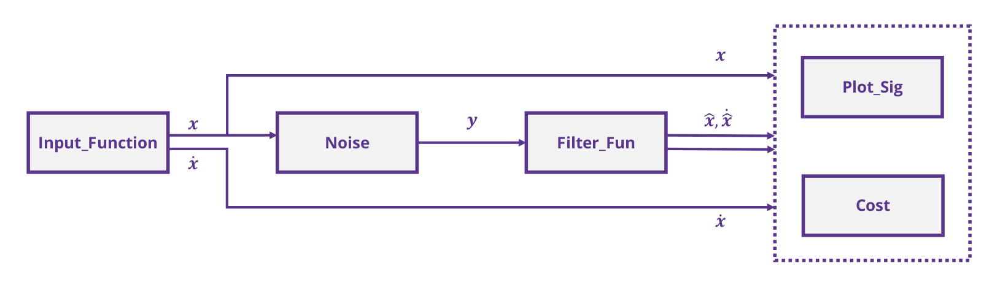
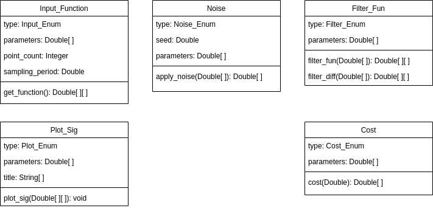

# OS-RST
Oberseminar am Institut für Regelungs- und Steuerungstheorie zum Thema: Differentiation verrauschter Messsignale

Die verschiedenen "main..."-Files sind zur simulativen Untersuchung der Filter auszuführen, wobei auch der jeweilige Autor für mögliche Rückfragen benannt ist.

Simulationsrahmenparameter:
* point_counter = 500, step_size = 2e-3
* noise_std_dev = 0.1 ... 0.5 in 0.1 Schritten
* sine    = Input_Function(Input_Enum.SINE, [1, 0.5, 0, 0], sampling_period = step_size, point_counter=point_counter)
* polynome = Input_Function(Input_Enum.POLYNOM, [4,-6,3,0], sampling_period = step_size, point_counter=point_counter)

Die prinzipielle Struktur der Signalflüsse ist in folgendem Diagramm dargestellt:

  

Sowie die Struktur der Klassen:

